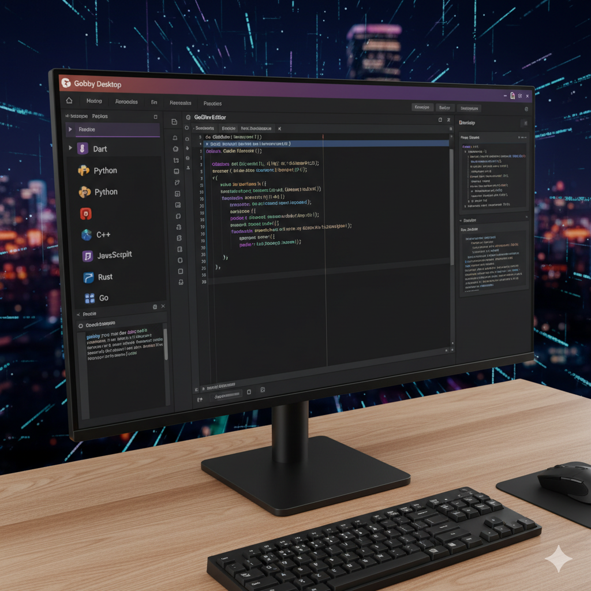

Here is a sample `README.md` file tailored for your Dart language project "./gobviwerat", which is a desktop editor developed in the style of Gobby:



```markdown
# ./gobviwerat

## Overview
./gobviwerat is a desktop collaborative text editor project developed using Dart. Inspired by the Gobby editor, this project integrates real-time editing capabilities with a user-friendly desktop interface designed for efficient document collaboration and development.

## Features
- Real-time collaborative text editing
- Cross-platform desktop support
- Syntax highlighting and document management
- Modular architecture with extensible editor components
- Built with Dart for scalability and ease of development

## Technology Stack
- Language: Dart
- Framework: Flutter (for desktop UI)
- Networking: WebSocket integration for real-time syncing
- Platform Target: Windows, macOS, Linux

## Installation
1. Ensure you have Dart SDK and Flutter installed.
2. Clone the repository:
   ```
   git clone https://your-repo-url.git ./gobviwerat
   ```
3. Navigate to the project directory:
   ```
   cd ./gobviwerat
   ```
4. Get dependencies:
   ```
   flutter pub get
   ```
5. Run the app:
   ```
   flutter run -d windows  # or macos, linux depending on your platform
   ```

## Usage
Open the app, create or join collaborative editing sessions, and start editing documents with multiple users in real-time. Uses WebSocket for backend communication and sync.

## Development
To contribute or customize:
- Explore the `lib/` directory for core editor logic.
- Use `gobby.dart` as the base editor UI.
- Extend networking modules to support additional real-time features.
- Implement new editor plugins following the modular design.

## Code Structure
```
./gobviwerat/
├── lib/
│   ├── gobby.dart           # Editor UI and core logic
│   ├── networking.dart      # WebSocket communication
│   └── utils.dart           # Utility functions
├── test/                   # Unit and widget tests
├── pubspec.yaml            # Dart package configuration
├── README.md               # Project documentation (this file)
└── main.dart               # Entry point for application
```

## Contributing
Contributions are welcome! Please fork the repository and submit a pull request. Follow the Dart and Flutter style guidelines and include tests for new features.

## License
This project is licensed under the MIT License. See the [LICENSE](LICENSE) file for details.

## Contact
For questions or feedback, open an issue on GitHub or contact the maintainer at your-email@example.com.
```

This README.md provides a comprehensive overview, installation instructions, development guidance, and licensing details specific to your Dart desktop collaborative editor project, facilitating clear communication for users and contributors.

[1](https://pub.dev/packages/flutter_project_structure/versions/1.0.3)
[2](https://www.dartai.com/templates/project-readme)
[3](https://www.walturn.com/insights/how-to-create-an-effective-flutter-readme)
[4](https://stackoverflow.com/questions/23989232/is-there-a-way-to-represent-a-directory-tree-in-a-github-readme-md)
[5](https://dart.dev/tools/pub/writing-package-pages)
[6](https://github.com/Flutterando/flutterando-readme-template)
[7](https://dart.dev/tools/pub/package-layout)
[8](https://www.freecodecamp.org/news/how-to-structure-your-readme-file/)
[9](https://docs.flutter.dev/packages-and-plugins/developing-packages)